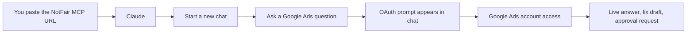
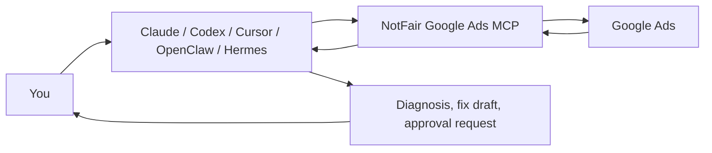
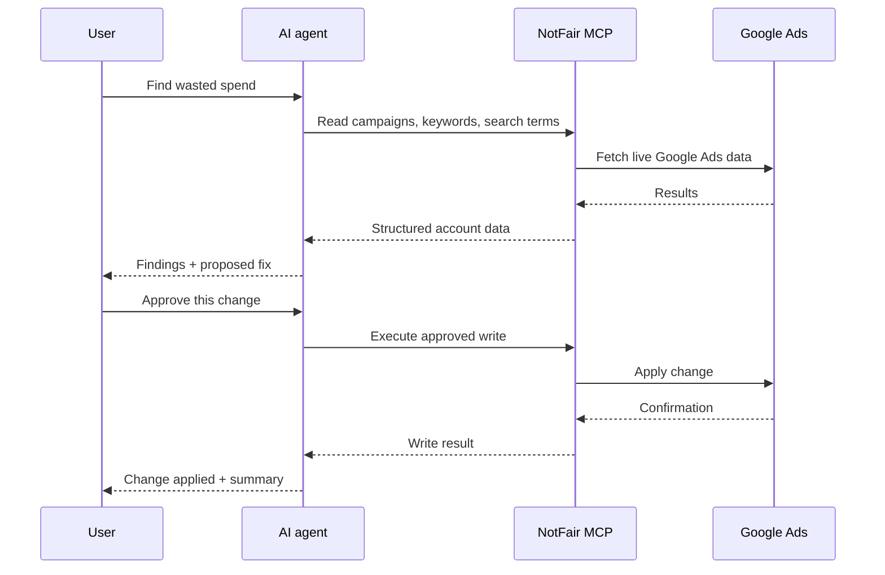

# Google Ads MCP by NotFair

[](https://modelcontextprotocol.io)
[](https://notfair.co/)
[](LICENSE)

Find what's wrong. Fix it from your AI agent.

NotFair connects Claude, OpenAI Codex, Cursor, Cline, OpenClaw, Hermes, and other MCP-compatible agents to live Google Ads data. Your agent can diagnose account issues, draft fixes, and execute campaign changes only after you approve.

> This repo is the public setup guide for NotFair's hosted Google Ads MCP. You do not need to clone this repo, create Google API credentials, or run a local server.

## Claude setup

For Claude users, setup is just one URL:

```text
https://notfair.co/api/mcp/google_ads
```

1. Open Claude settings.
2. Go to Connectors.
3. Add a custom connector.
4. Paste `https://notfair.co/api/mcp/google_ads`.
5. If Claude asks for a name, use `NotFair-GoogleAds`.
6. Start a new Claude chat and ask your first Google Ads question.
7. Claude will prompt you to authorize NotFair inside that chat conversation.
8. Sign in with the Google account that has Google Ads access.

You do not need to create a Google Ads developer token, OAuth app, API key, or local MCP server.

First prompt:

```text
Find keywords that have not been converting.
```



## Other clients

Codex, Cursor, Cline, OpenClaw, Hermes, and other MCP clients use the same hosted server URL:

```text
https://notfair.co/api/mcp/google_ads
```

## OpenAI Codex

Run:

```bash
codex mcp add NotFair-GoogleAds --url https://notfair.co/api/mcp/google_ads
```

Then follow the browser sign-in flow.

## Cursor, Cline, OpenClaw, Hermes, and other MCP clients

Use this MCP server config anywhere your client accepts MCP JSON:

```json
{
  "mcpServers": {
    "NotFair-GoogleAds": {
      "url": "https://notfair.co/api/mcp/google_ads"
    }
  }
}
```

If your agent can set up MCP servers from a prompt, use:

```text
Connect to the NotFair Google Ads MCP at https://notfair.co/api/mcp/google_ads. Use OAuth if available. Start with a read-only Google Ads audit and wait for my approval before making any changes.
```

## How it works



## What users can ask

Use business-language prompts. You do not need to know Google Ads internals before starting.

```text
Find what's wrong with my Google Ads account and rank fixes by wasted spend.
```

```text
Find irrelevant search terms from the last 30 days. Draft negative keyword changes and wait for approval.
```

```text
Compare this week to last week. Explain what changed in spend, conversions, CPA, and conversion rate.
```

```text
Find campaigns where budget changes are justified. Show the math before recommending an increase.
```

```text
Draft new responsive search ads for the weakest ad group. Do not publish anything until I approve.
```

More complete examples are in [USAGE_EXAMPLES.md](USAGE_EXAMPLES.md).

## How writes stay controlled



Rules to follow:

- Reads can inspect live Google Ads data after authorization.
- Writes should be reviewed before they land.
- Ask the agent to show the diff, expected impact, and rollback plan before approval.
- Reconnect at `https://notfair.co/connect` if auth expires.

## Troubleshooting

| Problem | Fix |
| --- | --- |
| The client cannot find the server | Check the URL is exactly `https://notfair.co/api/mcp/google_ads`. |
| The agent says auth expired | Reconnect at `https://notfair.co/connect`, then retry. |
| No Google Ads accounts appear | Sign in with the Google account that has access to the Ads customer. |
| OAuth opens but setup does not finish | Remove the connector, add it again, then retry the OAuth flow. |
| The agent wants to make a change too quickly | Ask it to run read-only diagnosis first and show the proposed diff before writing. |

## Links

- NotFair: https://notfair.co/
- Connect Google Ads: https://notfair.co/connect
- Usage examples: [USAGE_EXAMPLES.md](USAGE_EXAMPLES.md)
- Agent instructions: [AGENTS.md](AGENTS.md)
- Model Context Protocol: https://modelcontextprotocol.io

## License

This repository is open source under the [MIT License](LICENSE).

## Support

For setup help, contact `tong@notfair.co`.
